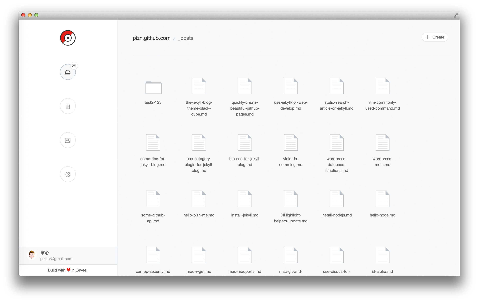

  

# Eevee - 伊布 

基于 Github Pages 的在线编辑平台，让你更加专注于内容的编写.

### 初衷

像黑客一样写博客太麻烦了 -- 需要在你的编辑器（Vim/Mou...）打开项目,然后编辑一篇 markdown 文章,写完之后还要 add/commit/push 等动作.为何不能简单些呢?我只关注于内容不是更好么?于是就有了这样的一个想法,需要有一个工具,让我可以在任何地方,任何时候,想写就写.这个工具,它就是 `伊布`.为喜欢在 GitHub 上分享文章的人精心打造.

### 构成及原理

纯前端实现,可以说没有 Server 层.通过 GitHub API 与你在 GitHub 上的代码库取得联系,获取 Project 的文章（_posts/）,完成增删查改的功能.依赖的数据前提:

* GitHub 账号（只在浏览器中记录）
* 基于 Jekyll 创建好的 Pages 项目, 文章存放在 `_posts` 目录下

### 演示及 Jekyll 主题结合

* 直接访问 [Eevee Online](http://pizn.github.io/eevee), 用 GitHub 账号登录, 可以编辑你的 `username.github.io` 上 `_posts` 目录下的文章
* Fork 我的 Jekyll 主题 -- [leafeon](http://github.com/pizn/leafeon) 到你的 `username.github.io` 上, 即可完成编辑

### 如何使用

1. 使用 GitHub 账号登录 Eevee（前提是你已经基于 GitHub Pages 建立好博客）
2. 选择文件,编辑, `Command + s` 保存即可
3. 稍等片刻,你的博客则刷新出新的文章

### 参与开发

该项目基于 React + Ant Design + GitHub API 完成.

1. npm install 
2. npm run hot-dev-server
3. npm run dev

### 特性

- [x] 登录 GitHub 账号,获取 `*.github.io` 或者 `*.github.com` 的 Project
- [x] 获取 `_posts` 的所有文档（仅 markdown ）
- [x] 添加文章
- [x] 编辑文章
- [x] 删除文章

### 计划

- [ ] 可自动创建 Project
- [ ] 提供草稿编辑功能
- [ ] 管理图片等静态文件功能
- [ ] 编辑配置

## Author

#### PIZn

* https://github.com/pizn
* https://twitter.com/piznlin
* http://www.pizn.net

#### Donate

如果你认为我做的这些对你来说是有价值的, 并鼓励我进行更多开源和免费的开发. 那你可以资助我, 就算是一杯咖啡...If you find my work useful and you want to encourage the development of more free resources, you can do it by donating.

PIZn 的支付宝二维码:

PIZn 的微信支付二维码:

## License

Copyright (c) 2016 PIZn.

Permission is hereby granted, free of charge, to any person obtaining a copy of this software and associated documentation files (the "Software"), to deal in the Software without restriction, including without limitation the rights to use, copy, modify, merge, publish, distribute, sublicense, and/or sell copies of the Software, and to permit persons to whom the Software is furnished to do so, subject to the following conditions:

The above copyright notice and this permission notice shall be included in all copies or substantial portions of the Software.

THE SOFTWARE IS PROVIDED "AS IS", WITHOUT WARRANTY OF ANY KIND, EXPRESS OR IMPLIED, INCLUDING BUT NOT LIMITED TO THE WARRANTIES OF MERCHANTABILITY, FITNESS FOR A PARTICULAR PURPOSE AND NONINFRINGEMENT. IN NO EVENT SHALL THE AUTHORS OR COPYRIGHT HOLDERS BE LIABLE FOR ANY CLAIM, DAMAGES OR OTHER LIABILITY, WHETHER IN AN ACTION OF CONTRACT, TORT OR OTHERWISE, ARISING FROM, OUT OF OR IN CONNECTION WITH THE SOFTWARE OR THE USE OR OTHER DEALINGS IN THE SOFTWARE.
